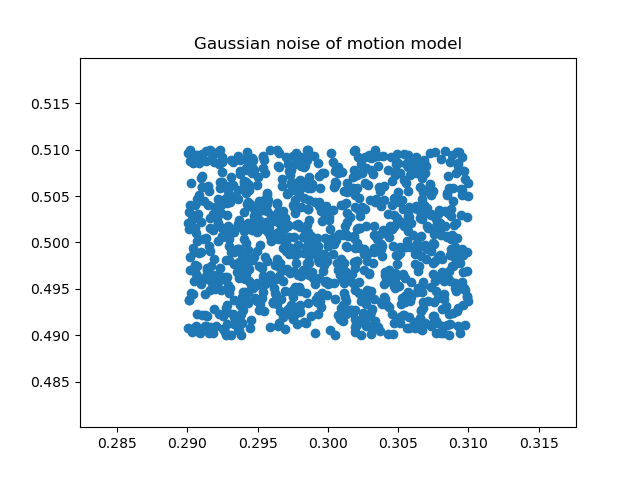

# Graph-SLAM

## Setup
CHAMP is used for a model of a robot. ROS packages for CHAMP can be found [here](https://github.com/chvmp/champ).
A couple of launch and rviz files are modified according to the purpose of the project.
Please change the rviz launch file in the champ_description folder as stated in rviz_viewer.launch file.

Scikit-learn is used for the ICP algorithm. Please install the library in order to run the program.  
If you are on Linux, you can install it by typing "pip install scikit-learn" on a command terminal.

## Start the simulation
Please launch gazebo.launch in autonomous_navigation folder.
When Rviz and Gazebo pop up on the screen and start working, add map, pointArray and path on Rviz.  
Open up another command terminal and run graph_slam.py. 
Set a right topic for each map, pointARray and path on Rviz.

## Odometry noisy model
The odometry sensor is assumed to be correct and it is the ground truth.
To emulate the real sensors, errors have to be added to the measurements.
The previous model uses random.uniform, it creates uniform error between -0.01 to 0.01, however, it does not imitate real measurements errors for the simulation.

The new model follows normal distributions and a robot motion model.
Here are the graphs that show the difference in error distributions.

  
   

## Scan matching

