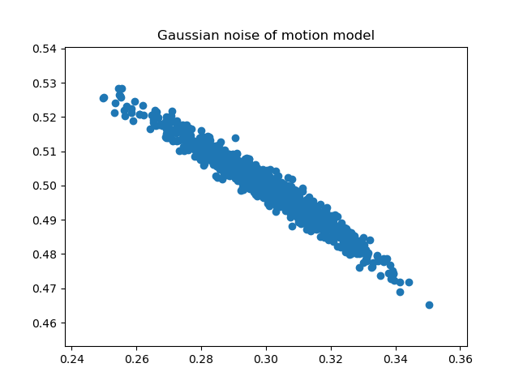

# autonomous_navigation

## Odometry noisy model
The odometry sensor is assumed to be correct and it is the ground truth.
To emulate the real sensors, errors have to be added to the measurements.
The previous model uses random.uniform, it creates uniform error between -0.01 to 0.01, however, it does not imitate real measurements errors for the simulation.

The new model follows normal distributions and a robot motion model.
Here are the graphs that show the difference in error distributions.

  
   

